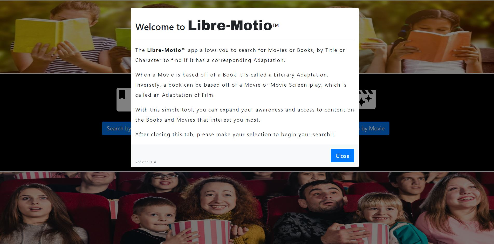
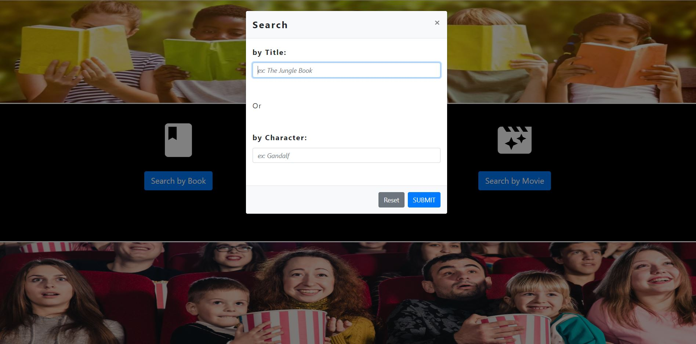
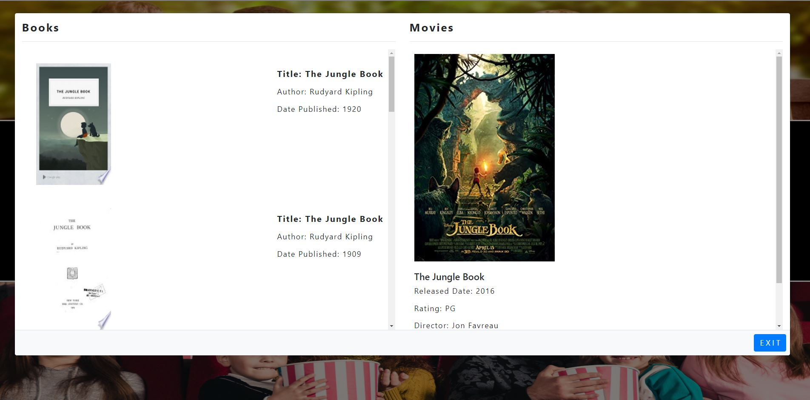

# Project-1

## TheLibre-Motio App allows you to search for Movies and Books by Title or Character, looking for cross adaptations.  This app was developed to answer the question, was this Movie originally based off a book? or vice versa.

## Deployed on GitHub Pages <a href="https://pchiii.github.io/Project-1/" rel="nofollow"> here.</a>

- - -
## Home Page:

- - -

## Search Main Page:

- - -
## Search Form Page:

- - -

## Results Page:

 
## Technologies Used:

* Bootstrap
* Animate CSS
* Material Icons
* Google Fonts
* JQuery
* Javascript
* OMDB API
* GOOGLE API

